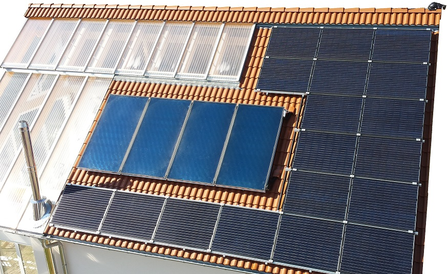

# Home-power-storage
AC coupled power storage for home supply

Build with:
- 3.6 kWp Photovoltaic house roof system and solar inverter </img> 
- Electricity meter reading head with USB-Interface </img> 
  - reading the reading head using a Raspberry Pi (it was already there from the house automation) and the [libsm](src/rasperry_pi/libsml/examples/sma_mqtt.py), sending the current reference line to an MQTT broker
- 14s/250Ah Battery from an VW e-up! </img> 
- Energus Tiny BMS </img> 
- 500 Watt Solar Inverter from AEC with RS485 </img>
- 2000 Watt Eltek power supply </img>
- Arduino Mega-2560 with CAN and RS485 for controlling </img>
- 3 Relais

</img>
